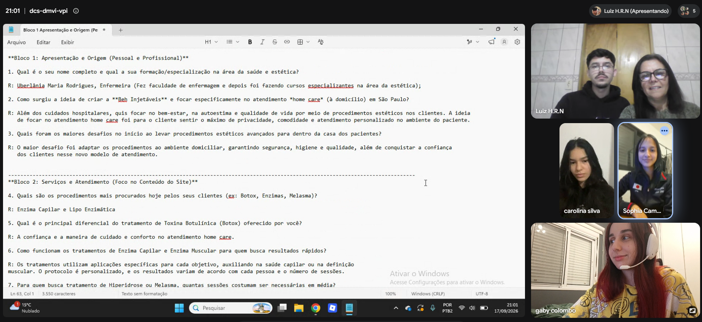
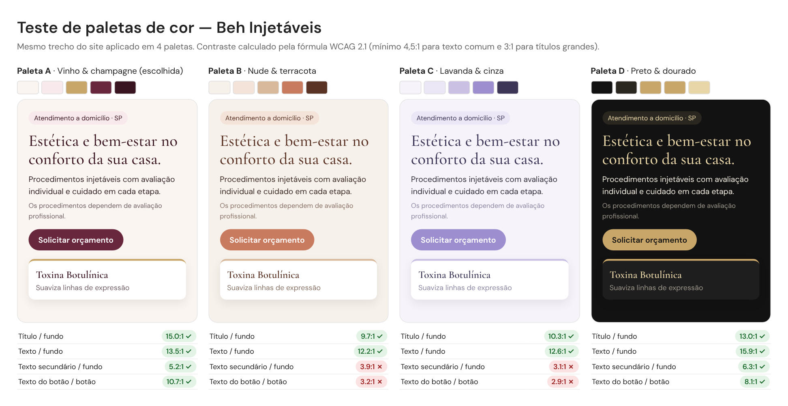
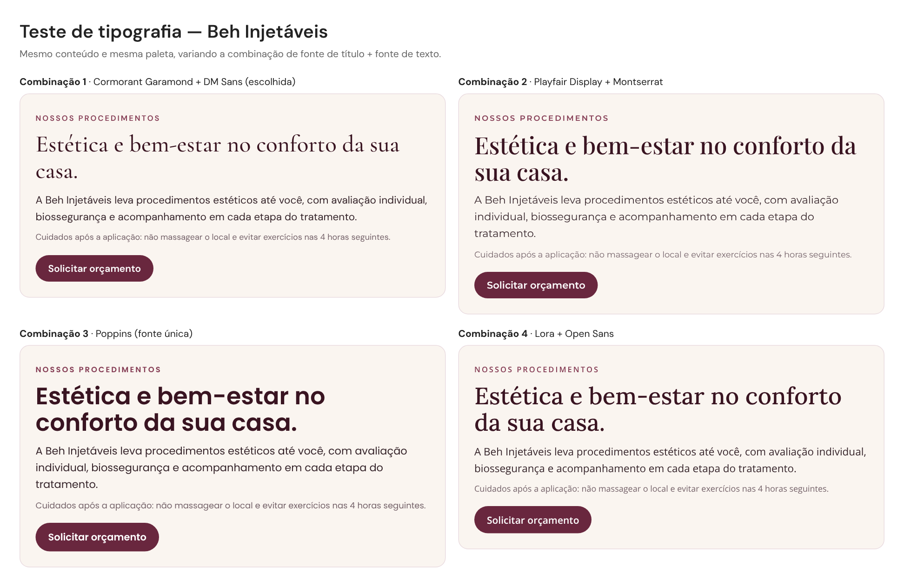

# Beh Injetáveis — Site institucional

**Disciplina:** Desenvolvimento Frontend para Web (A2) — 2026.2
**Professor:** Cid Andrade
**Etapas:** Entrega 1 (estrutura em HTML5) e Entrega 2 (CSS, JavaScript, multimídia e publicação)

🔗 **Site publicado:** https://colombogaby.github.io/beh-injetaveis/

## Integrantes do grupo
- Luiz Henrique Rodrigues Nunes - RGM: 47402822 - github.com/luizrnunes
- Gabriela Colombo Martins Blach - RGM: 47132281 - github.com/Colombogaby
- Carolina da Silva Burrego - RGM: 47793431 - github.com/carolinaburrego
- Sophia Campos - RGM: 46887776 - github.com/sophiacampos0612

## Contato do profissional
WhatsApp: (11) 97013-1416
E-mail: uber.rodrigues1969@gmail.com
Instagram: beh.injetáveis

---

## 1. Introdução

Este projeto apresenta o site institucional da **Beh Injetáveis**, uma organização real
especializada em procedimentos estéticos injetáveis realizados a domicílio na cidade de
São Paulo/SP. O objetivo do site é apresentar a empresa e seus procedimentos (Botox, enzima
capilar, lipo enzimática, enzima muscular, tratamento de hiperidrose e tratamento de
melasma), passar confiança para quem ainda não conhece o atendimento em casa e facilitar o
contato direto e a solicitação de orçamento.

Na Entrega 1, o grupo construiu a estrutura do site em HTML5 semântico. Na Entrega 2, o site
ganhou identidade visual com CSS, interações com JavaScript, recursos multimídia, validação
completa no W3C e a definição de um domínio próprio.

---

## 2. Desenvolvimento

### 2.1 Entrevista com a organização

O grupo realizou uma reunião remota por **Google Meet** com a responsável pela Beh
Injetáveis, seguindo um roteiro de perguntas elaborado previamente: apresentação e origem do
negócio, serviços e forma de atendimento, biossegurança e logística das visitas a domicílio.
As respostas definiram o conteúdo das páginas de procedimentos (indicação, duração e
cuidados após a aplicação) e os canais de contato usados no site.

**Comprovação do contato real** — print da reunião no Google Meet com o grupo (Luiz,
Carolina, Sophia e Gabriela) durante a entrevista:



### 2.2 Estrutura do site

O site tem **10 páginas interligadas** por um menu de navegação igual em todas elas:

| Página | Conteúdo |
|---|---|
| `index.html` | Página inicial: apresentação, diferenciais, procedimentos em cards, experiência de atendimento, áudio e vídeo, chamada para contato |
| `paginas/sobre-nos.html` | Quem é a Beh Injetáveis, como funciona o atendimento a domicílio e diferenciais |
| `paginas/contato.html` | Formulário de contato com validação nativa do HTML5 e outros canais |
| `paginas/orcamento.html` | Formulário de orçamento com seleção dos procedimentos de interesse |
| `paginas/botox.html` | Toxina botulínica |
| `paginas/enzima-capilar.html` | Enzima capilar |
| `paginas/lipo-enzimatica.html` | Lipo enzimática |
| `paginas/enzima-muscular.html` | Enzima muscular |
| `paginas/hiperidrose.html` | Tratamento de hiperidrose |
| `paginas/melasma.html` | Tratamento de melasma |

Todas as páginas usam marcação semântica (`header`, `nav`, `main`, `section`, `article`,
`footer`). Os formulários usam validação nativa do HTML5, sem depender de JavaScript:
`required`, `minlength`, `type="email"`, `type="tel"` e `pattern` (por exemplo, telefone com
11 dígitos e CEP com 8 dígitos).

### 2.3 Pesquisa de layout de sites da mesma área

Antes de definir o visual, o grupo analisou sites de clínicas e profissionais de estética
injetável para entender como o setor organiza as informações:

| Site | O que observamos |
|---|---|
| [Botoclinic](https://botoclinic.com/) | Rede de clínicas. Banners promocionais no topo, procedimentos "favoritos" em cards com imagem, título, uma linha de descrição e link "Saiba mais", depoimentos de clientes e botão de compra pelo WhatsApp. |
| [Botocenter](https://www.botocenter.com.br/) | Foco em um único procedimento (Botox). Cards com as regiões de aplicação, um passo a passo do protocolo em 3 etapas, números de confiança e botões de WhatsApp espalhados pela página. |
| [Botopremium — Lipo enzimática](https://www.botopremium.com.br/servico/lipo-enzimatica-de-papada/) | Página de procedimento com título, uma foto e um texto corrido, seguida de uma grade de "outros serviços" em cards. O texto não é separado por tópicos. |
| [Kamila Farias Estética](https://www.kamilafariasestetica.com.br/) | Profissional autônoma. Paleta rosa clara, títulos com palavras em itálico, foto da profissional no topo, seção "como funciona" em 4 passos numerados, FAQ e várias chamadas para agendar pelo WhatsApp. |

**O que levamos para o site da Beh Injetáveis:**

- **Topo com uma frase de impacto e chamada para ação**, padrão em todos os sites analisados.
- **Procedimentos em cards** com imagem, nome, descrição curta e link para a página
  própria, como na Botoclinic e na Botopremium.
- **Explicar como o atendimento funciona**, como fazem a Botocenter e a Kamila Farias com
  seus passos numerados. Para um serviço a domicílio isso passa confiança, então a página
  Sobre Nós tem a seção "Como funciona o atendimento a domicílio" e a inicial tem uma seção
  sobre a experiência de atendimento.
- **Contato sempre por perto**: chamada para orçamento no fim da página inicial e contatos
  (telefone, e-mail e Instagram) no rodapé.

**O que decidimos fazer diferente:**

- As redes grandes usam muitos banners de promoção. Como a Beh é uma profissional
  autônoma, optamos por um visual mais limpo e acolhedor, mais próximo do site da Kamila
  Farias do que das franquias.
- Na Botopremium, a página do procedimento é um texto corrido. Nas nossas páginas, cada
  procedimento é dividido em **o que é**, **indicação e duração** e **cuidados após a
  aplicação**, para facilitar a leitura.

### 2.4 Testes de paleta de cores

Testamos o mesmo trecho do site (título, texto, aviso, botão e um card de procedimento) em
quatro paletas e medimos o **contraste** de cada combinação pela fórmula da WCAG 2.1, que
recomenda no mínimo 4,5:1 para textos comuns.



| Paleta | Título | Texto | Texto secundário | Botão | Resultado |
|---|---|---|---|---|---|
| **A · Vinho & champagne** | 15,0:1 | 13,5:1 | 5,2:1 | 10,7:1 | ✅ Passa em todos |
| B · Nude & terracota | 9,7:1 | 12,2:1 | 3,9:1 | 3,2:1 | ❌ Botão e texto secundário abaixo do mínimo |
| C · Lavanda & cinza | 10,3:1 | 12,6:1 | 3,1:1 | 2,9:1 | ❌ Botão e texto secundário abaixo do mínimo |
| D · Preto & dourado | 13,0:1 | 15,9:1 | 6,3:1 | 8,1:1 | ✅ Passa em todos |

As paletas B e C são bonitas, mas o texto branco nos botões claros fica difícil de ler, e o
botão é justamente o elemento mais importante da página. Entre as duas que passaram, a
paleta D (preto e dourado) ficou com cara de marca de luxo noturna e pouco acolhedora para
um atendimento feito dentro da casa da cliente. Escolhemos a **paleta A**: o vinho transmite
sofisticação, o rosé e o marfim deixam o visual leve e o dourado aparece em detalhes.

### 2.5 Testes de tipografia

Com a paleta escolhida, comparamos quatro combinações de fonte de título + fonte de texto:



- **Playfair Display + Montserrat:** elegante, mas o título fica pesado e a Montserrat é
  larga, o que deixa os parágrafos mais compridos.
- **Poppins (fonte única):** moderna e muito legível, mas o título em negrito ficou com cara
  de aplicativo ou academia, longe do clima de cuidado e bem-estar.
- **Lora + Open Sans:** bastante legível, porém mais "editorial", lembrando um blog.
- **Cormorant Garamond + DM Sans (escolhida):** a Cormorant dá um título delicado e
  sofisticado, combinando com estética, e a DM Sans é limpa e fácil de ler nos textos menores,
  como os cuidados após a aplicação.

### 2.6 Identidade visual em CSS

Todo o estilo está em um único arquivo, `assets/css/style.css`, compartilhado pelas 10
páginas:

- **Variáveis CSS** (`:root`) para cores, fontes, sombras, bordas arredondadas e largura
  máxima. Mudar uma cor em um lugar muda o site inteiro, sem regras repetidas.
- **Componentes padronizados:** cards de procedimentos, botões, selos, formulários e rodapé
  seguem as mesmas cores, cantos e sombras.
- **Grid Layout** para as grades (cards de procedimentos, diferenciais, mídia) e **Flexbox**
  para alinhamentos internos (menu, cabeçalho, botões, rodapé).
- **Responsividade** com media queries: em telas pequenas os cards passam para uma coluna e o
  menu vira um botão.
- **SVG:** os ícones de telefone, e-mail e Instagram no rodapé da página inicial são
  desenhados em SVG direto no HTML e herdam a cor do texto pelo CSS.

### 2.7 Interações com JavaScript

O arquivo `assets/js/script.js` responde a eventos do usuário:

- **Menu para celulares:** abre e fecha ao clicar no botão "Menu", fecha ao clicar em um
  link, ao apertar `Esc` ou ao aumentar a tela.
- **Botão "voltar ao topo":** aparece depois de rolar a página e sobe com rolagem suave.
- **Animações ao rolar:** as seções aparecem suavemente quando entram na tela.
- **Link ativo:** o item do menu da página atual fica destacado.
- **Ano automático** no rodapé e um aviso no lugar de imagens que não carregarem.

### 2.8 Multimídia

A página inicial tem uma seção com áudio de apresentação (`<audio>`) e vídeo institucional
(`<video>`), e as páginas de procedimentos têm fotos dos tratamentos. Na página inicial e nas
páginas de enzima muscular e lipo enzimática foram usadas fotos diferentes, para não repetir
a mesma imagem.

### 2.9 Validação W3C

Na Entrega 1, todas as 10 páginas foram validadas no [Nu Html Checker (W3C)](https://validator.w3.org/),
sem erros. Um aviso identificado na página de contato (ausência de heading dentro de um
`article`) foi corrigido adicionando um `h3`.

Na Entrega 2, depois de adicionar o CSS e o JavaScript, o site foi validado novamente,
usando o endereço publicado no GitHub Pages:

- **HTML:** as 10 páginas passaram no [Nu Html Checker](https://validator.w3.org/) sem erros
  nem avisos. Na revalidação, o checker apontou que as páginas internas não tinham um título
  de nível 1. O título de cada página passou a ser um `h1` e os subtítulos subiram um nível,
  mantendo a hierarquia correta (`h1` → `h2`) sem alterar o visual.
- **CSS:** a folha de estilo `assets/css/style.css` passou no
  [Serviço de Validação de CSS do W3C](https://jigsaw.w3.org/css-validator/) sem erros
  (CSS nível 3 + SVG). Os alertas exibidos são apenas informativos (uso de variáveis CSS e
  `@import` de fontes) e não indicam problemas.

**Comprovação** (prints em `assets/img/validacao/`):

| Página | Print |
|---|---|
| Início (`index.html`) | [html-index.png](assets/img/validacao/html-index.png) · [endereço raiz](assets/img/validacao/html-site-raiz.png) |
| Sobre Nós | [html-sobre-nos.png](assets/img/validacao/html-sobre-nos.png) |
| Botox | [html-botox.png](assets/img/validacao/html-botox.png) |
| Enzima Capilar | [html-enzima-capilar.png](assets/img/validacao/html-enzima-capilar.png) |
| Lipo Enzimática | [html-lipo-enzimatica.png](assets/img/validacao/html-lipo-enzimatica.png) |
| Enzima Muscular | [html-enzima-muscular.png](assets/img/validacao/html-enzima-muscular.png) |
| Hiperidrose | [html-hiperidrose.png](assets/img/validacao/html-hiperidrose.png) |
| Melasma | [html-melasma.png](assets/img/validacao/html-melasma.png) |
| Orçamento | [html-orcamento.png](assets/img/validacao/html-orcamento.png) |
| Contato | [html-contato.png](assets/img/validacao/html-contato.png) |
| CSS (`style.css`) | [css-style.png](assets/img/validacao/css-style.png) |

### 2.10 Decisões e desafios

- **HTML semântico desde o início:** na Entrega 1, o grupo priorizou escolher a tag certa
  para cada conteúdo. Isso facilitou a Entrega 2, porque o CSS pôde ser aplicado sobre uma
  estrutura já organizada.
- **Um único arquivo de CSS:** existia uma cópia antiga do `style.css` na raiz do projeto que
  nenhuma página usava. Ela foi removida para evitar código redundante.
- **Hierarquia de títulos:** ao estilizar, percebemos que as páginas internas começavam no
  `h2`. Corrigir isso exigiu ajustar os títulos de 9 páginas e o CSS para manter o mesmo
  visual.
- **Imagens:** as fotos dos procedimentos foram reduzidas para no máximo 1000 px, para o site
  carregar mais rápido sem perder qualidade.
- **Acessibilidade das cores:** o teste de contraste mostrou que paletas que pareciam boas
  não eram legíveis nos botões, o que mudou nossa forma de escolher cores.

### 2.11 Como seria fazer este site com IA

Seria possível chegar a um resultado parecido pedindo o site para uma IA generativa. O
processo seria:

1. **Briefing:** escrever um prompt com o nome da empresa, os 6 procedimentos, o público, o
   estilo desejado (elegante, acolhedor) e os requisitos da disciplina (10 páginas, HTML
   semântico, formulário com validação nativa, áudio, vídeo, SVG, Grid e Flexbox).
2. **Geração da estrutura:** pedir o `index.html` e uma página de procedimento como modelo, e
   depois as demais páginas seguindo o mesmo padrão.
3. **Geração do estilo:** pedir um `style.css` com paleta e fontes definidas e um
   `script.js` com o menu mobile e o botão de voltar ao topo.
4. **Iteração:** abrir o site no navegador, apontar o que ficou ruim e pedir ajustes, várias
   vezes.
5. **Revisão e validação:** passar tudo no W3C e corrigir o que a IA errou.

Mesmo assim, a IA não substituiria partes essenciais do trabalho: **a entrevista com a
organização real**, as informações verdadeiras sobre os procedimentos e os contatos, as fotos,
a conferência de que o conteúdo está correto e a validação final. A IA também tende a gerar
textos genéricos e código maior do que o necessário, o que exige revisão cuidadosa. Ela
acelera a parte de código, mas o conteúdo e a responsabilidade pelo resultado continuam com o
grupo.

---

## 3. Uso de IA

O grupo usou duas ferramentas de IA ao longo do projeto:

**ChatGPT (OpenAI) — versão gratuita, com o modelo padrão do site**
- Apoio na construção do CSS: o grupo usou o ChatGPT para tirar dúvidas enquanto escrevia o
  estilo do site e para revisar o código aos poucos, conferindo se não estava fazendo nada
  errado.

**Claude (Anthropic) — modelo Claude Opus 5.5**
- Comparar o repositório com o enunciado da Entrega 2 e listar o que faltava.
- Criar os ícones em SVG do rodapé, adicionar o `article` na página de orçamento e remover o
  CSS duplicado.
- Pesquisar sites de estética para a análise de layout, montar os testes de paleta (com o
  cálculo de contraste) e de tipografia.

**Motivação:** usamos a IA para ganhar tempo nas tarefas repetitivas e técnicas (validação,
tratamento de imagens, ajustes de código) e para ter um apoio na pesquisa e nos testes
visuais, deixando o grupo focado nas decisões e no conteúdo da organização.

**Verificação das respostas:** nenhuma resposta foi aceita sem conferência. O grupo:
- validou todas as páginas e o CSS nos validadores oficiais do W3C e guardou os prints;
- abriu o site publicado para conferir cada alteração no navegador, inclusive no celular;
- conferiu as informações dos procedimentos com o que foi levantado na entrevista;
- conferiu a disponibilidade do domínio diretamente no Registro.br;
- revisou os textos gerados e ajustou o que não correspondia ao que o grupo fez.

---

## 4. Site hospedado

O site está publicado no **GitHub Pages**:
**https://colombogaby.github.io/beh-injetaveis/**

## 5. Domínio

O site está publicado no GitHub Pages, mas a Beh Injetáveis ainda não possui um domínio
próprio. O domínio escolhido pelo grupo é **`behinjetaveis.com.br`**: ele repete exatamente
o nome da marca (o mesmo usado no Instagram), é curto, fácil de lembrar, e a terminação
`.com.br` indica uma empresa brasileira, o que combina com um atendimento local em São Paulo.

**Pesquisa de disponibilidade:** a consulta no [Registro.br](https://registro.br), órgão
responsável pelos domínios `.br`, mostrou que o domínio está **disponível para registro**.


**Custo** (valores exibidos na consulta): R$ 40,00 por 1 ano, R$ 76,00 por 2 anos ou
R$ 184,00 por 5 anos.

**Processo de aquisição:**

1. A responsável pela Beh Injetáveis cria uma conta no Registro.br com o próprio CPF ou CNPJ,
   para que o domínio fique em nome da dona do negócio, e não do grupo.
2. Pesquisa `behinjetaveis.com.br`, clica em **Registrar**, escolhe o período (1, 2 ou 5 anos)
   e faz o pagamento.
3. Após a confirmação do pagamento, configura no painel do Registro.br os registros de DNS
   apontando para os servidores do GitHub Pages.
4. No repositório, em **Settings → Pages → Custom domain**, informa `behinjetaveis.com.br` e
   ativa o HTTPS. A partir daí, o site passa a abrir pelo domínio próprio.

---

## 6. Conclusão

Na Entrega 1, o grupo aprendeu a estruturar um site real com HTML5 semântico e a transformar
uma entrevista com uma empresa em conteúdo organizado. Na Entrega 2, esse conteúdo ganhou
forma: definimos uma identidade visual, aplicamos CSS com variáveis, Grid e Flexbox,
adicionamos interações com JavaScript e publicamos o site validado.

O maior aprendizado desta etapa foi perceber que design também se testa. Comparar paletas e
fontes lado a lado, e medir o contraste em vez de escolher só pelo gosto, mostrou que uma
cor bonita pode tornar um botão ilegível. A revalidação no W3C também mostrou que uma
mudança visual pode afetar a estrutura do HTML, e que validar no fim de cada etapa evita
acumular problemas. Por fim, o uso de IA mostrou que ela ajuda bastante na parte técnica,
mas que a pesquisa com a organização real, a revisão e as decisões continuam dependendo do
grupo.

---

## Estrutura de pastas

```
beh-injetaveis/
├── index.html
├── paginas/
│   ├── sobre-nos.html
│   ├── contato.html
│   ├── orcamento.html
│   ├── botox.html
│   ├── enzima-capilar.html
│   ├── lipo-enzimatica.html
│   ├── enzima-muscular.html
│   ├── hiperidrose.html
│   └── melasma.html
├── assets/
│   ├── css/
│   │   └── style.css
│   ├── js/
│   │   └── script.js
│   ├── img/
│   │   ├── (fotos dos procedimentos e comprovante da entrevista)
│   │   ├── validacao/   (prints do W3C)
│   │   ├── testes/      (testes de paleta e tipografia)
│   │   └── dominio/     (pesquisa no Registro.br)
│   ├── audio/
│   └── video/
└── README.md
```

## Colaboradores

- Luiz Henrique Rodrigues Nunes
- Carolina da Silva Burrego
- Sophia Campos
